# Micro-Rover (Zade) - WiFi Control System

This document provides a technical specification and operational manual for the Micro-Rover (Zade) platform, an ESP8266-based differential drive robot with an embedded real-time web server for telemetry and control.

---

## 1. System Architecture Overview

The system consists of three main layers: the physical/mechanical layer, the embedded control layer, and the client-side user interface.

```
+-------------------------------------------------------------+
|                 Client Browser / Controller                 |
|   (Virtual Joystick / Keyboard / Sensor API / Canvas UI)    |
+-------------------------------------------------------------+
                              |
                     WiFi HTTP REST API
                              |
                              v
+-------------------------------------------------------------+
|                    ESP8266 Microcontroller                  |
|  (ESP8266WebServer / DHCP Service / mDNS / GPIO Control)    |
+-------------------------------------------------------------+
                              |
                      H-Bridge Control
                              |
                              v
+-------------------------------------------------------------+
|                  Dual H-Bridge Motor Driver                 |
|             (Speed Modulation via 10-bit PWM)               |
+-------------------------------------------------------------+
                              |
                      Differential Drive
                              |
                              v
+-------------------------------------------------------------+
|                   Left & Right DC Motors                    |
+-------------------------------------------------------------+
```

---

## 2. Visual Documentation

Below are the engineering, assembly, and physical build step-by-step photos of the Micro-Rover platform.

### 2.1 Assembly and Mechanical Views
<div align="center">
  <table border="0">
    <tr>
      <td align="center">
        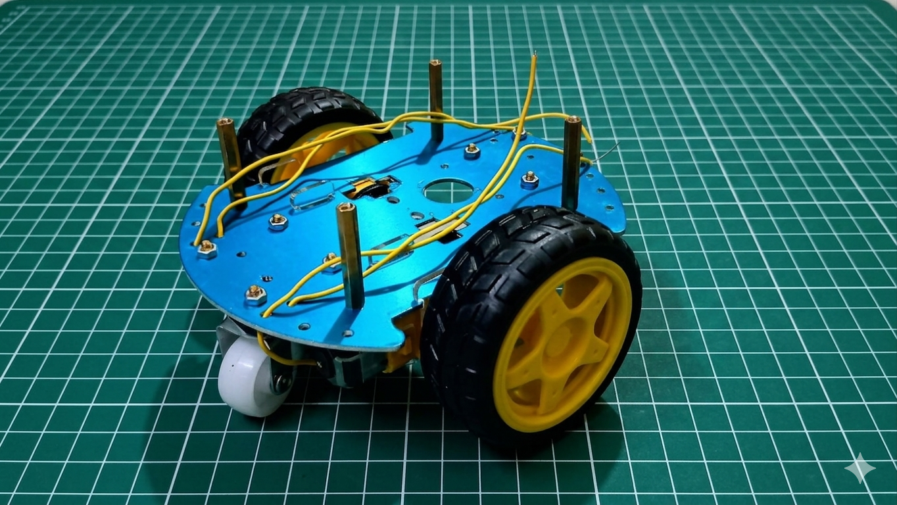
        <br /><em>Figure 1: Isometric mechanical view without electronics</em>
      </td>
      <td align="center">
        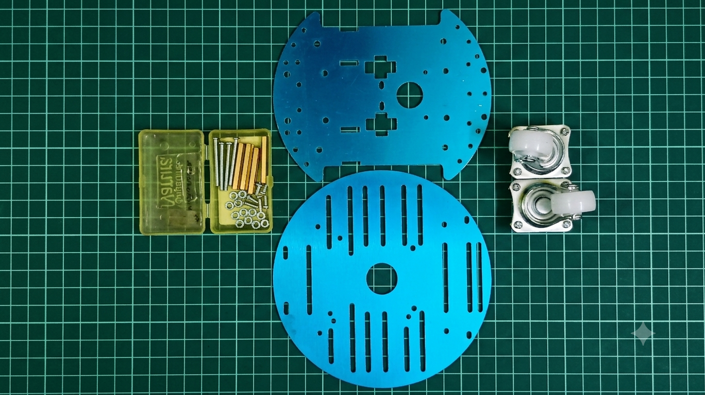
        <br /><em>Figure 2: Exploded / detailed mechanical structural view</em>
      </td>
    </tr>
    <tr>
      <td align="center" style="padding-top: 20px;">
        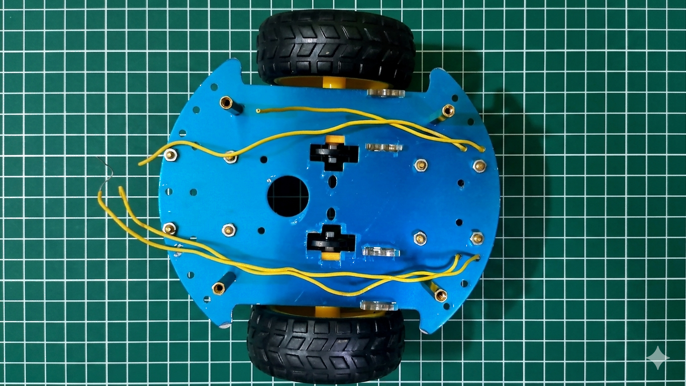
        <br /><em>Figure 3: Top-down fully assembled layout</em>
      </td>
      <td align="center" style="padding-top: 20px;">
        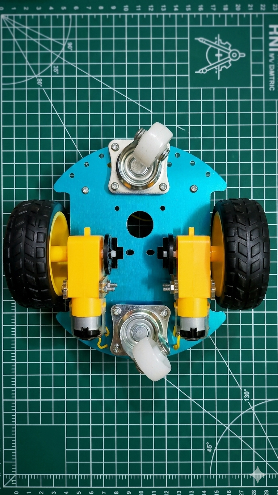
        <br /><em>Figure 4: Bottom-up wheel and structural chassis layout</em>
      </td>
    </tr>
  </table>
</div>

### 2.2 Electronic Components
<div align="center" style="margin-top: 20px;">
  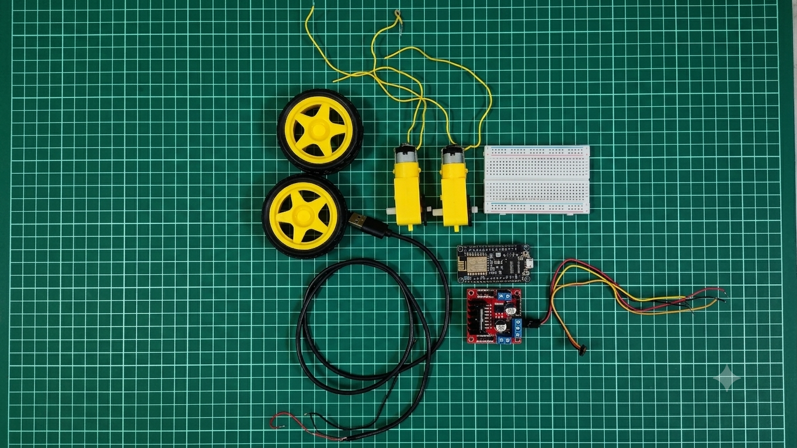
  <br /><em>Figure 5: All the Electric Components</em>
</div>

### 2.3 Electronic Assembly Walkthrough
The following step-by-step visual log documents the assembly process of the rover's physical chassis, component mounting, wiring routing, and final validation:

<div align="center">
  <table border="0">
    <tr>
      <td align="center">
        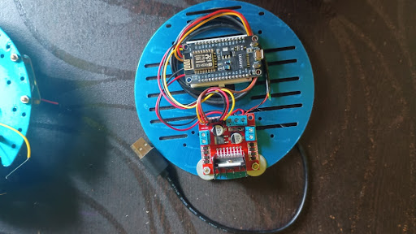
        <br /><em>Step 1: Mounting structural electronics plate</em>
      </td>
      <td align="center">
        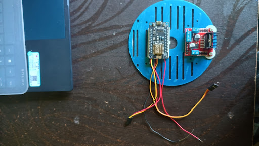
        <br /><em>Step 2: Securing the microcontroller board</em>
      </td>
      <td align="center">
        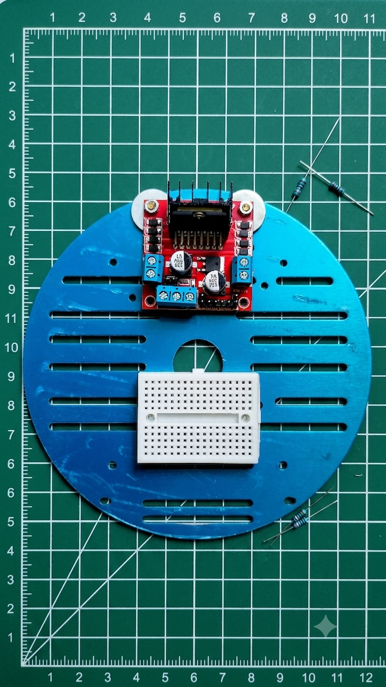
        <br /><em>Step 3: Component layout blueprint</em>
      </td>
    </tr>
    <tr>
      <td align="center" style="padding-top: 15px;">
        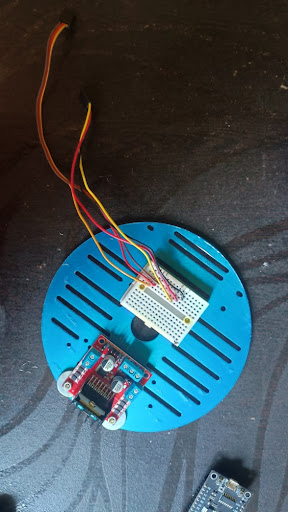
        <br /><em>Step 4: Primary wiring and routing</em>
      </td>
      <td align="center" style="padding-top: 15px;">
        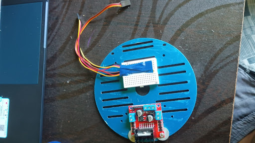
        <br /><em>Step 5: Secondary signal connection routing</em>
      </td>
      <td align="center" style="padding-top: 15px;">
        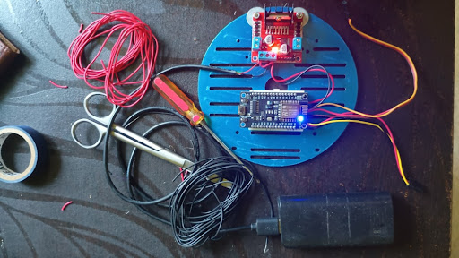
        <br /><em>Step 6: Electrical continuity validation</em>
      </td>
    </tr>
    <tr>
      <td align="center" style="padding-top: 15px;">
        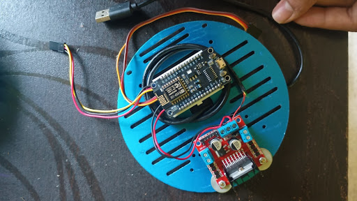
        <br /><em>Step 7: Power cable integration</em>
      </td>
      <td align="center" style="padding-top: 15px;">
        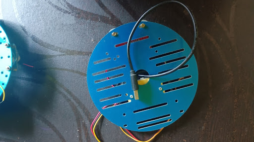
        <br /><em>Step 8: Assembled chassis top view</em>
      </td>
      <td align="center" style="padding-top: 15px;">
        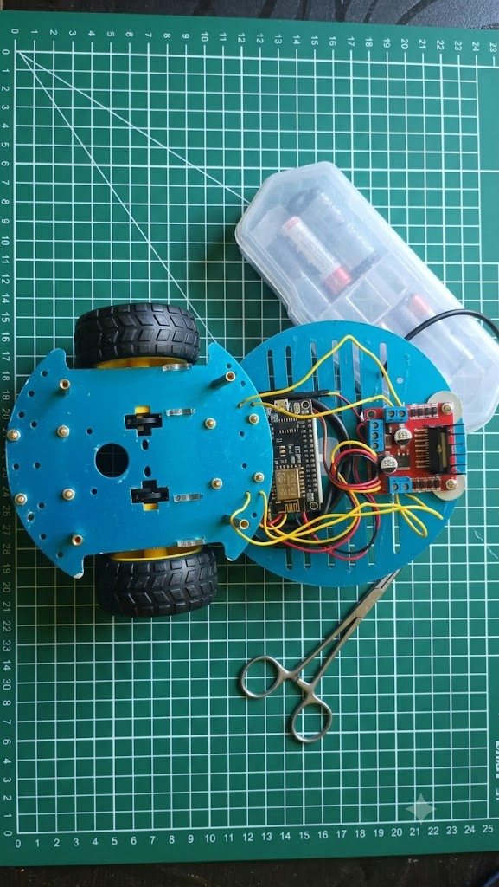
        <br /><em>Step 9: Final integrated platform</em>
      </td>
    </tr>
  </table>
</div>

---

## 3. Kinematic Model & Odometry

### 3.1 Kinematics
The robot employs a two-wheel differential drive kinematics model. Steering is achieved by creating a velocity differential between the left and right wheels.

Given a normalized linear velocity input <b><i>v</i> ∈ [-1, 1]</b> and a normalized angular velocity input <b><i>ω</i> ∈ [-1, 1]</b> from the user interface:

<div align="center">
  <i><b>V<sub>L</sub> = clamp(v + ω, -1, 1)</b></i>
  <br />
  <i><b>V<sub>R</sub> = clamp(v - ω, -1, 1)</b></i>
</div>

Where <b><i>V<sub>L</sub></i></b> and <b><i>V<sub>R</sub></i></b> are the target left and right wheel velocities respectively. These values are mapped to 10-bit pulse-width modulation (PWM) values for the motor driver pins:

<div align="center">
  <i><b>PWM<sub>L</sub> = V<sub>L</sub> × 1023</b></i>
  <br />
  <i><b>PWM<sub>R</sub> = V<sub>R</sub> × 1023</b></i>
</div>

### 3.2 Dead Reckoning (Odometry)
By translating wheel speeds <b><i>(V<sub>L</sub>, V<sub>R</sub>)</i></b> into tangential physical velocities <b><i>v<sub>L</sub></i></b> and <b><i>v<sub>R</sub></i>v<sub>R</sub></i></b> using the wheel radius <b><i>r</i></b>, the and angular velocities <b><i>ω<sub>L</sub>, ω<sub>R</sub></i></b>:

<div align="center">
  <i><b>v<sub>L</sub> = r · ω<sub>L</sub>, &nbsp;&nbsp;&nbsp; v<sub>R</sub> = r · ω<sub>R</sub></b></i>
</div>

The aggregate linear velocity <b><i>v<sub>robot</sub></i></b> and angular velocity <b><i>ω<sub>robot</sub></i></b> are calculated relative to the wheelbase chassis track width L:

<div align="center">
  <i><b>v<sub>robot</sub> = (v<sub>R</sub> + v<sub>L</sub>) / 2</b></i>
  <br />
  <i><b>ω<sub>robot</sub> = (v<sub>R</sub> - v<sub>L</sub>) / L</b></i>
</div>

To track coordinates <b><i>(x, y)</i></b> and heading orientation <b><i>θ</i></b> in the global coordinate frame across small time increments <b><i>Δt</i></b>:

<div align="center">
  <i><b>x<sub>t+Δt</sub> = x<sub>t</sub> + v<sub>robot</sub> · cos(θ<sub>t</sub>) · Δt</b></i>
  <br />
  <i><b>y<sub>t+Δt</sub> = y<sub>t</sub> + v<sub>robot</sub> · sin(θ<sub>t</sub>) · Δt</b></i>
  <br />
  <i><b>θ<sub>t+Δt</sub> = θ<sub>t</sub> + ω<sub>robot</sub> · Δt</b></i>
</div>

---

## 4. State Transition Control Flow

The firmware initialization and execution cycle inside the single-threaded microcontroller system are illustrated by the state diagram below:

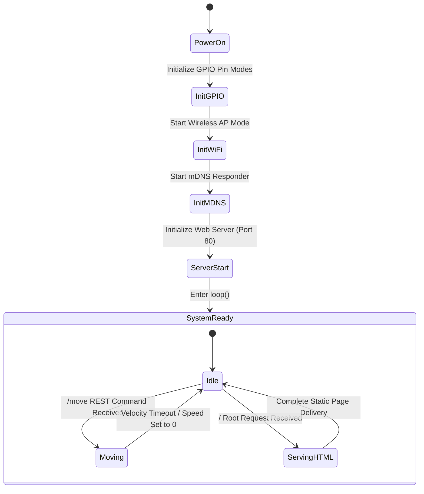

---

## 5. Network Architecture

The ESP8266 is configured to operate exclusively in Access Point (AP) mode. It creates an isolated IEEE 802.11 b/g/n wireless network.

### 5.1 Network Parameters
*   **SSID (Network Name)**: `micro_rover`
*   **WPA2-PSK Key (Password)**: `12345678`
*   **Gateway IP Address**: `192.168.4.1`
*   **Subnet Mask**: `255.255.255.0`
*   **DHCP Server**: Integrated (leases IP addresses automatically to connected clients in the `192.168.4.X` subnet range).
*   **mDNS Responder**: Resolves queries for `http://micro-rover.local` to `192.168.4.1`.

---

## 6. Hardware and Electrical Specifications

### 6.1 Pin Mapping Table

The microcontroller directs the H-bridge controller using digital direction signals (HIGH/LOW) and analog speed modulation (PWM).

<table width="100%">
  <thead>
    <tr style="background-color: #2c3e50; color: white;">
      <th>ESP8266 GPIO Pin</th>
      <th>Motor Driver Pin</th>
      <th>Signal Type</th>
      <th>Functional Description</th>
    </tr>
  </thead>
  <tbody>
    <tr>
      <td><strong>D1 (GPIO5)</strong></td>
      <td>IN1</td>
      <td>Digital Output</td>
      <td>Left Motor Phase Direction Control A</td>
    </tr>
    <tr>
      <td><strong>D2 (GPIO4)</strong></td>
      <td>IN2</td>
      <td>Digital Output</td>
      <td>Left Motor Phase Direction Control B</td>
    </tr>
    <tr>
      <td><strong>D6 (GPIO12)</strong></td>
      <td>IN3</td>
      <td>Digital Output</td>
      <td>Right Motor Phase Direction Control A</td>
    </tr>
    <tr>
      <td><strong>D7 (GPIO13)</strong></td>
      <td>IN4</td>
      <td>Digital Output</td>
      <td>Right Motor Phase Direction Control B</td>
    </tr>
    <tr>
      <td><strong>D0 (GPIO16)</strong></td>
      <td>ENA</td>
      <td>PWM Output (10-bit)</td>
      <td>Left Motor Speed Enable / PWM Modulation</td>
    </tr>
    <tr>
      <td><strong>D5 (GPIO14)</strong></td>
      <td>ENB</td>
      <td>PWM Output (10-bit)</td>
      <td>Right Motor Speed Enable / PWM Modulation</td>
    </tr>
    <tr>
      <td><strong>GND</strong></td>
      <td>GND</td>
      <td>Reference Ground</td>
      <td>Common Ground Reference</td>
    </tr>
  </tbody>
</table>

### 6.2 Power Isolation
To prevent electromagnetic interference (EMI) and power brownouts, the logic circuitry (ESP8266) and power circuitry (Motors/H-Bridge) must be isolated:
*   The ESP8266 should be powered via a regulated 5V USB connection.
*   The H-Bridge driver must be powered by a separate DC battery pack capable of supplying the motor load current.
*   All ground (GND) connections must be linked to establish a common electrical potential.

### 6.3 Technical Troubleshooting Matrix

<table width="100%">
  <thead>
    <tr style="background-color: #2c3e50; color: white;">
      <th>Obsymptom / Fault</th>
      <th>Potential Root Cause</th>
      <th>Verification & Mitigation Procedure</th>
    </tr>
  </thead>
  <tbody>
    <tr>
      <td>Microcontroller resets or drops connection when starting motion</td>
      <td>Ground bounce, inductive spikes, or momentary voltage sag on the logic line.</td>
      <td>Verify electrical isolation between power supply lines. Add decoupling capacitors (e.g., 220μF to 470μF electrolytic) across the motor driver’s input supply terminals.</td>
    </tr>
    <tr>
      <td>Chassis spins in place instead of moving forward</td>
      <td>Polarity inversion on one of the DC motor terminal outputs.</td>
      <td>Swap the physical wire connections on the motor driver terminal block for the inverted motor, or invert the digital output pins in the firmware.</td>
    </tr>
    <tr>
      <td>mDNS URL resolves on MacOS/iOS but fails on Windows/Android</td>
      <td>Lack of native multicast DNS (mDNS) resolution support on the host client's operating system.</td>
      <td>Install an mDNS routing responder (like iTunes/Bonjour on Windows) or fall back to addressing the controller directly via its IP address: <code>http://192.168.4.1</code>.</td>
    </tr>
    <tr>
      <td>Unstable motor speed or jittery navigation controls</td>
      <td>Missing common ground reference between the MCU and the motor driver.</td>
      <td>Verify that a physical wire connects a <code>GND</code> pin on the ESP8266 to the negative/GND terminal block on the H-Bridge driver board.</td>
    </tr>
  </tbody>
</table>

---

## 7. Communication Protocol & API Contract

All remote controls are negotiated using lightweight stateless HTTP GET requests:

### 7.1 Server API Contract Specifications

*   **Serving Dashboard Assets**:
    *   **Endpoint**: `/`
    *   **Method**: `GET`
    *   **Response Headers**:
        *   `Content-Type: text/html`
        *   `Connection: close`
    *   **Response Payload**: The raw HTML, styling sheets, and JavaScript files compiled into the program storage space (`INDEX_HTML`).

*   **Differential Navigation Request**:
    *   **Endpoint**: `/move`
    *   **Method**: `GET`
    *   **Query Parameters**:
        *   `left` (Required, Type: Integer, Range: `[-1023, 1023]`): Target duty cycle speed for the left wheels.
        *   `right` (Required, Type: Integer, Range: `[-1023, 1023]`): Target duty cycle speed for the right wheels.
    *   **Success Response**:
        *   `Status Code`: `200 OK`
        *   `Content-Type`: `text/plain`
        *   `Body`: `OK`
    *   **Client Error Response**:
        *   `Status Code`: `400 Bad Request`
        *   `Content-Type`: `text/plain`
        *   `Body`: `Bad Request` (Returned if query arguments are missing or malformed).

---

## 8. Software Architecture and Implementation

The firmware is executed sequentially in a single-threaded loop on the ESP8266 MCU.

### 8.1 Wireless Access Point Initialization
The firmware configures the ESP8266 in standalone Access Point mode utilizing the following initialization snippet inside `setup()`:

```cpp
// From setup() in main.ino:
WiFi.mode(WIFI_AP);
WiFi.softAP(WIFI_AP_SSID, WIFI_AP_PASS);

Serial.printf("\nAccess Point Started! AP IP: %s\n", 
              WiFi.softAPIP().toString().c_str());

if (MDNS.begin(MDNS_NAME)) {
    Serial.printf("mDNS: http://%s.local\n", MDNS_NAME);
}
```

### 8.2 Motor Controller Driver Snippet
The H-bridge controller is driven using high/low direction states and variable PWM speed mapping to the enable pins:

```cpp
// From main.ino:
void setMotor(int in1, int in2, int enablePin, int speedValue) {
    speedValue = constrain(speedValue, -MAX_PWM, MAX_PWM);

    if (speedValue > 0) {
        digitalWrite(in1, HIGH);
        digitalWrite(in2, LOW);
        analogWrite(enablePin, speedValue);
    } else if (speedValue < 0) {
        digitalWrite(in1, LOW);
        digitalWrite(in2, HIGH);
        analogWrite(enablePin, -speedValue);
    } else {
        digitalWrite(in1, LOW);
        digitalWrite(in2, LOW);
        analogWrite(enablePin, 0);
    }
}
```

### 8.3 HTTP Request Handler for Navigation Commands
The endpoint `/move` takes left and right arguments and translates them directly to PWM driver signals:

```cpp
// From main.ino:
void handleMove() {
    if (server.hasArg("left") && server.hasArg("right")) {
        moveRover(server.arg("left").toInt(), server.arg("right").toInt());
        server.send(200, "text/plain", "OK");
    } else {
        server.send(400, "text/plain", "Bad Request");
    }
}
```

---

## 9. Deployment and Operation

### 9.1 Uploading Firmware
1. Open the [main.ino](file:///home/remandey/my-programs/micro-rover/main/main.ino) file inside the Arduino IDE.
2. Ensure the ESP8266 core is installed via the Boards Manager.
3. Select the target board variant and COM port.
4. Execute the compilation and upload pipeline.

### 9.2 Establishing Control Link
1. Connect the host workstation or mobile device to the wireless access point: SSID: `micro_rover`, Password: `12345678`.
2. Navigate to `http://192.168.4.1` or `http://micro-rover.local` to start the interface.

---

## 10. Automated Python Automation Integration

The `scripts/` directory includes interface wrappers for remote script execution:
*   **[keyboard_control.py](scripts/keyboard_control.py)**: Low-latency keyboard command parsing.
*   **[dance_sequence.py](scripts/dance_sequence.py)**: Scripted pattern automation.
*   **[cv_target_tracking.py](scripts/cv_target_tracking.py)**: Target tracking integration template.
*   **[trace_shapes.py](scripts/trace_shapes.py)**: Geometric path tracing algorithms.

### How to run python automation:
1. Ensure your PC is connected to the **`micro_rover`** Wi-Fi network.
2. Install dependencies:
   ```bash
   pip install requests
   ```
3. Run the target script:
   ```bash
   python scripts/keyboard_control.py
   ```

---

## 11. Directory Structure

```
micro-rover/
├── control.html         # Prototype standalone HTML interface
├── index.html           # Embedded UI resource source code template
├── README.md            # Technical specification manual (This file)
├── main/
│   └── main.ino          # Primary ESP8266 C++ board firmware code
├── pictures/            # Mechanical design views & wiring diagram illustrations
│   ├── bottom_view.png
│   ├── electronics.png
│   ├── electronics_and_mechanical.jpeg
│   ├── electronics_checking.jpg
│   ├── electronics_placement.png
│   ├── electronics_plate.jpg
│   ├── fixing_mcu.jpg
│   ├── fixing_wires.jpg
│   ├── fixing_wires2.jpg
│   ├── mechanical.png
│   ├── power_cable.jpg
│   ├── rover_without_electronics_isometric.png
│   ├── top_view.png
│   └── top_view_after_electronics.jpg
└── scripts/             # Python scripting automation suite
    ├── cv_target_tracking.py
    ├── dance_sequence.py
    ├── keyboard_control.py
    ├── teleop.py
    └── trace_shapes.py
```